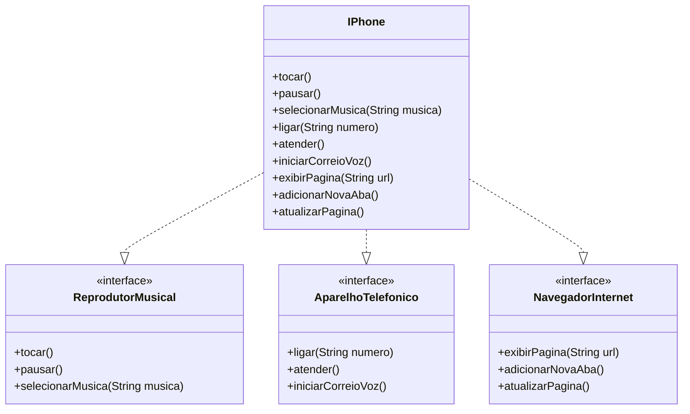

# 📱 Desafio POO: Modelagem do iPhone (2007)

Este repositório contém a modelagem e implementação técnica das funcionalidades do iPhone original, conforme apresentado no lançamento de 2007.

## 🛠️ Funcionalidades Modeladas

1. **Reprodutor Musical:** Selecionar, tocar e pausar músicas.
2. **Aparelho Telefônico:** Ligar, atender e gerenciar correio de voz.
3. **Navegador na Internet:** Exibir páginas, atualizar e gerenciar abas.

### 📊 Diagrama UML (Mermaid)

